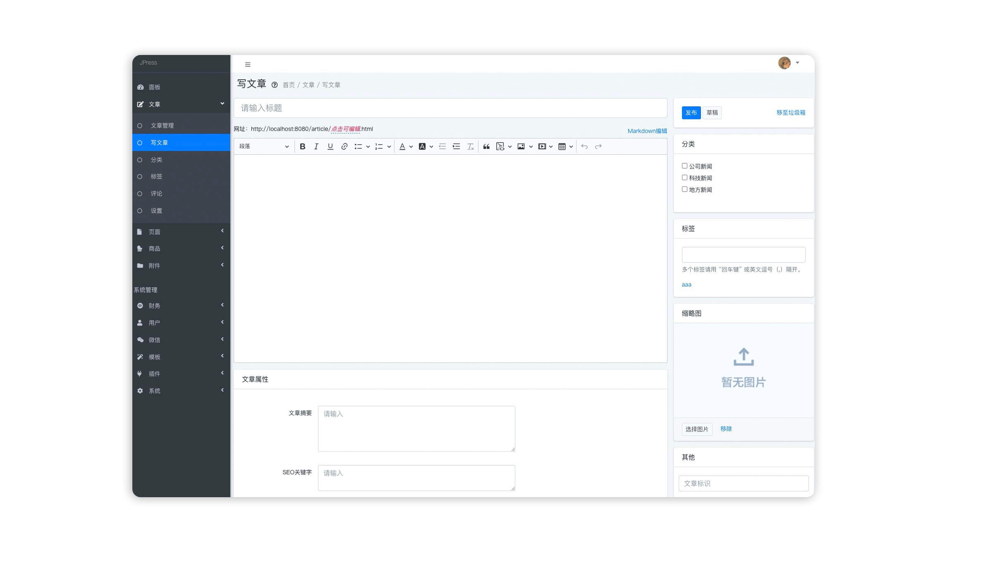

<!-- 直接书写html -->
<h1 align="center" style="display: block!important;"> JPress </h1>

<!-- Markdown变量 -->

[release]: https://img.shields.io/github/release/JpressProjects/jpress.svg?style=flat-square
